# Addiction and Mental Health prediction using machine learning (Project-3-data collection, cleaning and machine learning code)
The deployment is part of a different repository and is achieved using the Flask app via Heroku available here: https://predictions-project-3.herokuapp.com

Here are screenshots of the website:

## Introduction
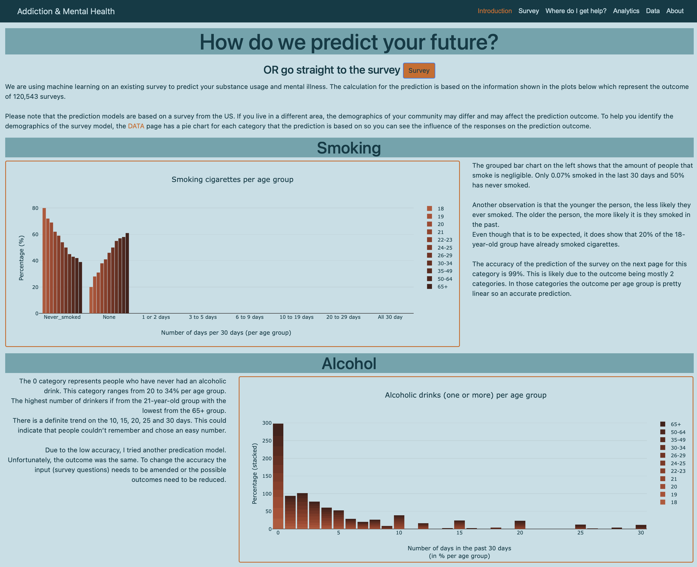
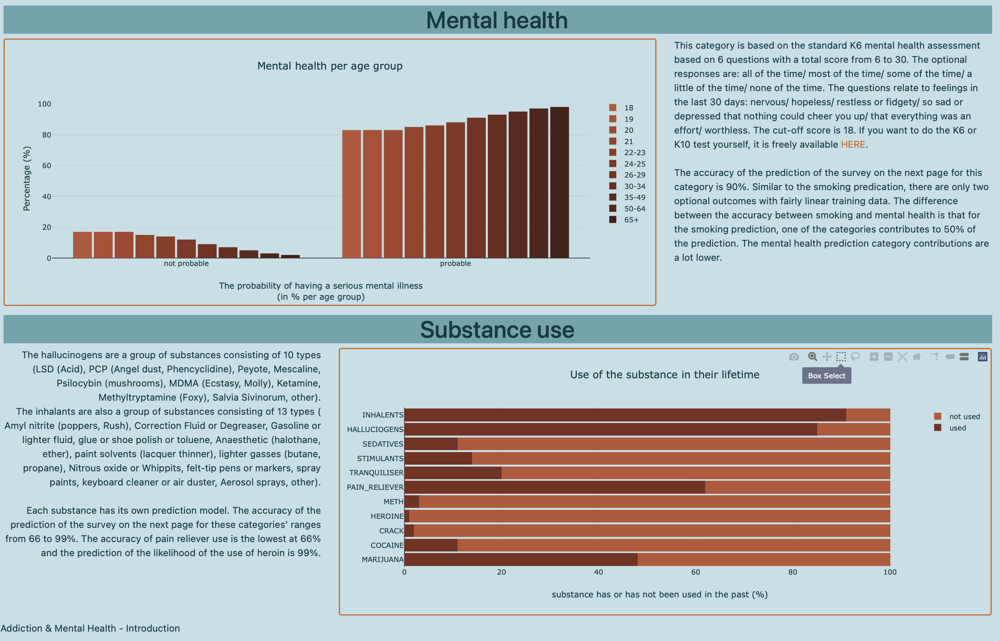

## Survey
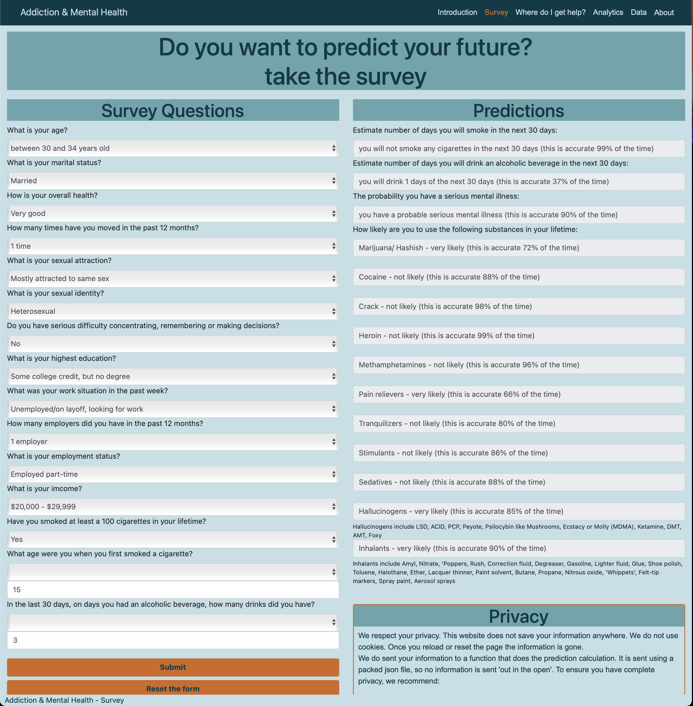

## Where do I get help?
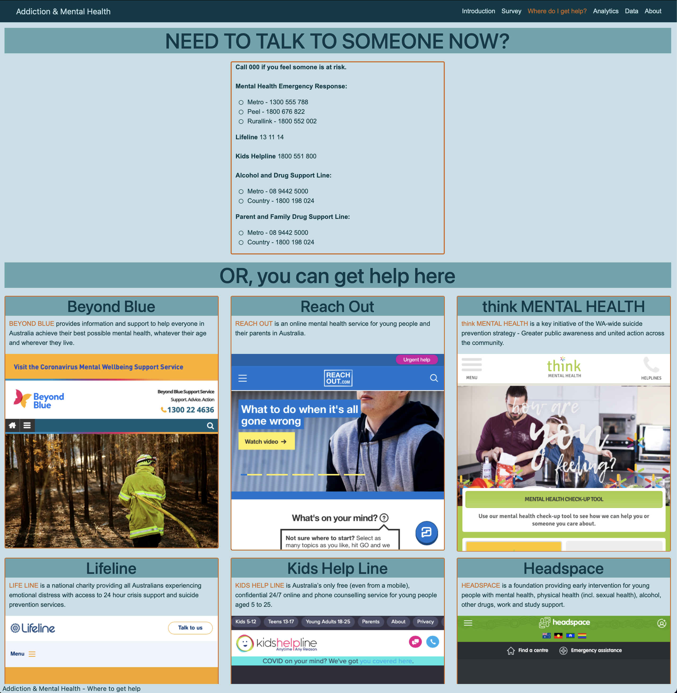

## Anlytics
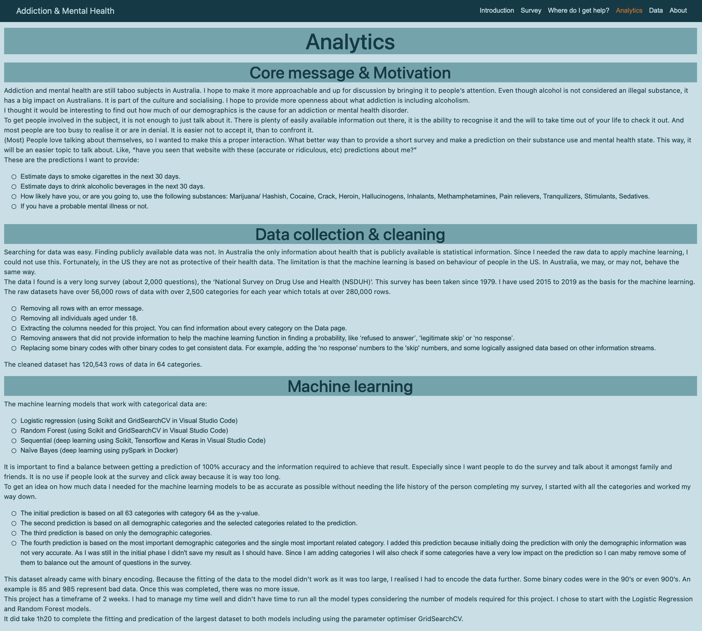
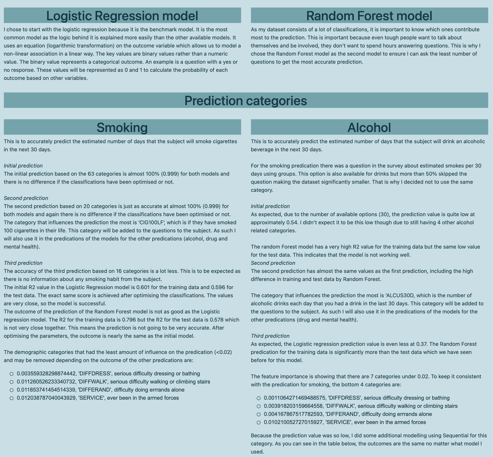
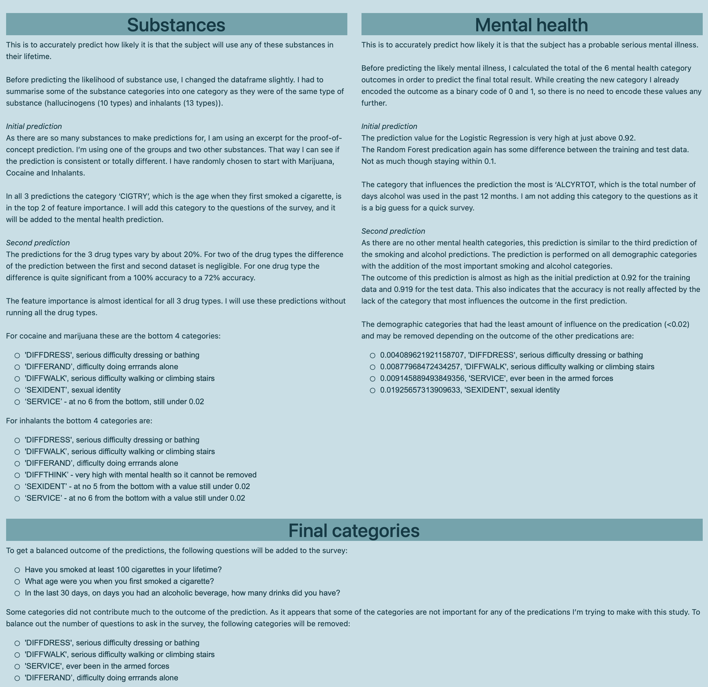
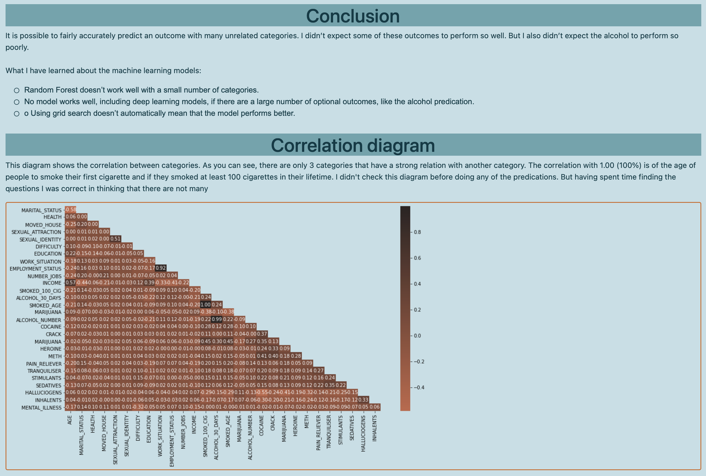
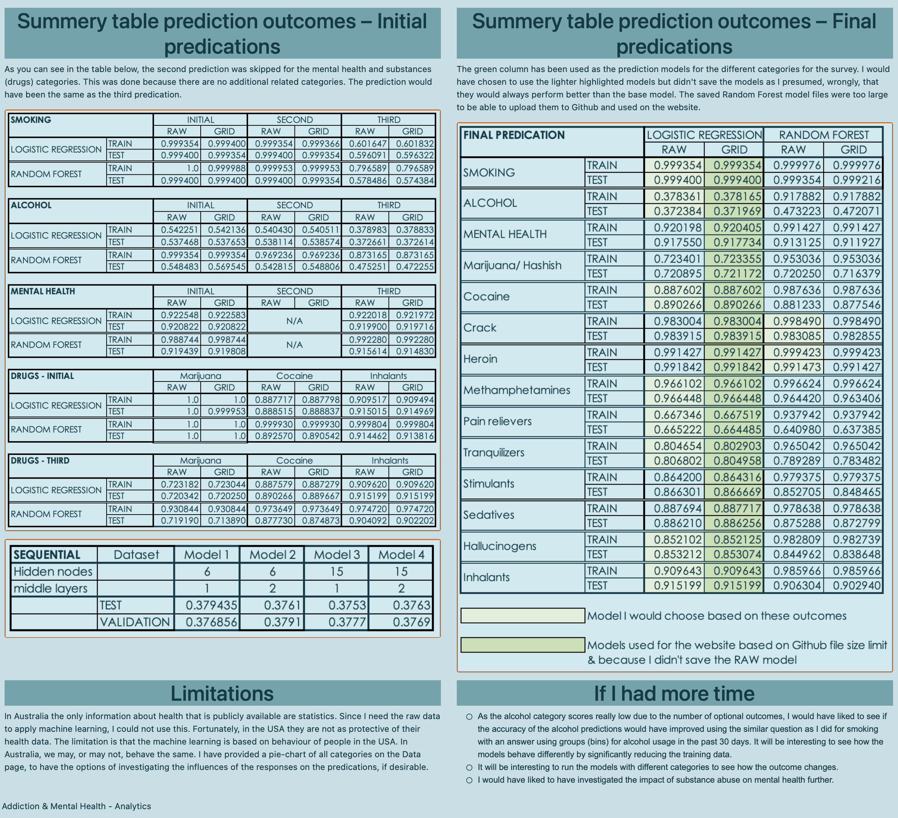

## Data
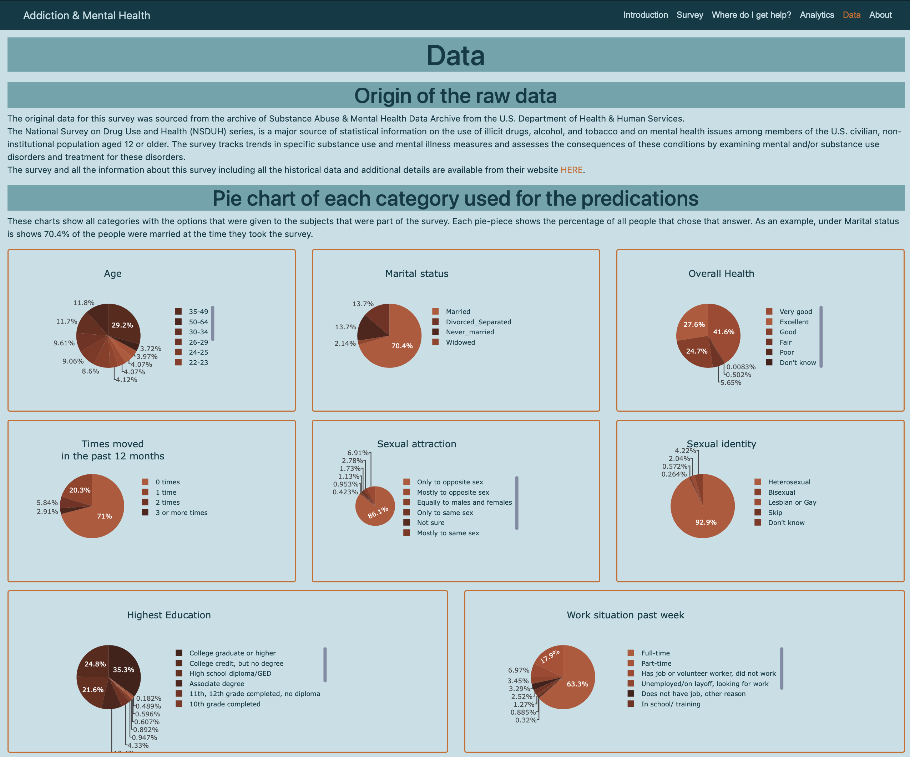
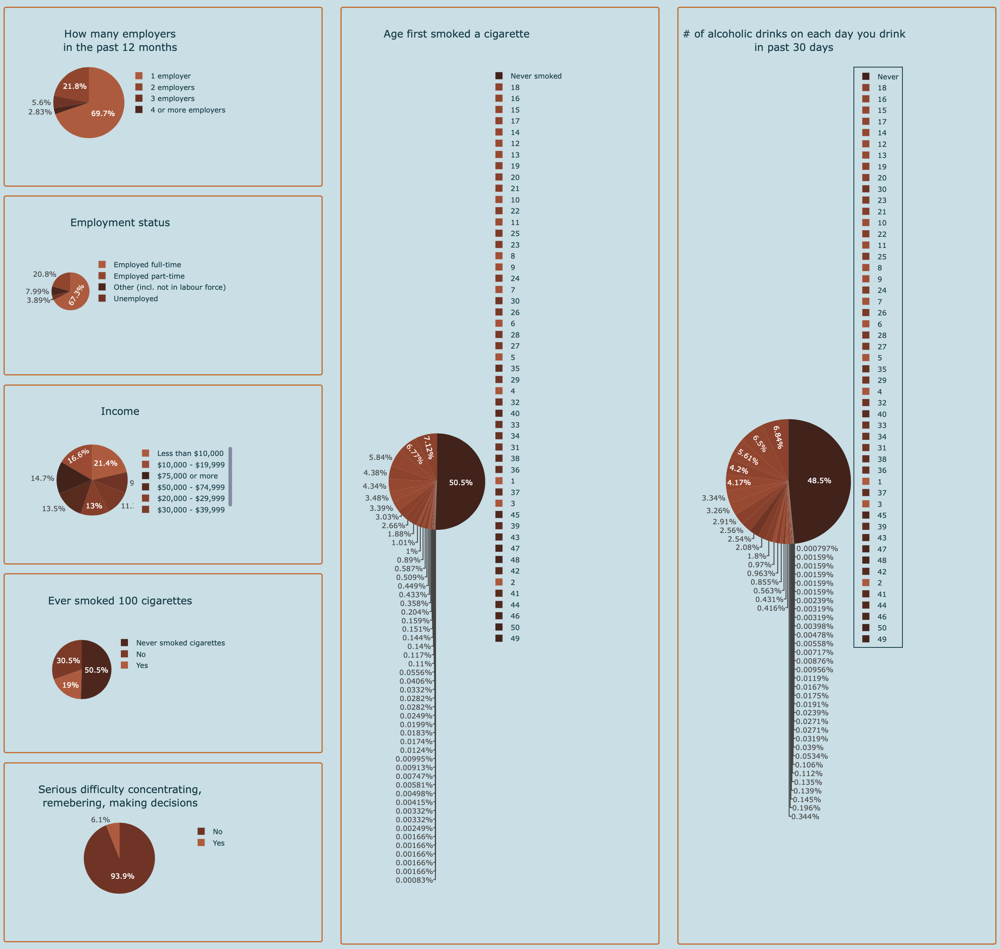
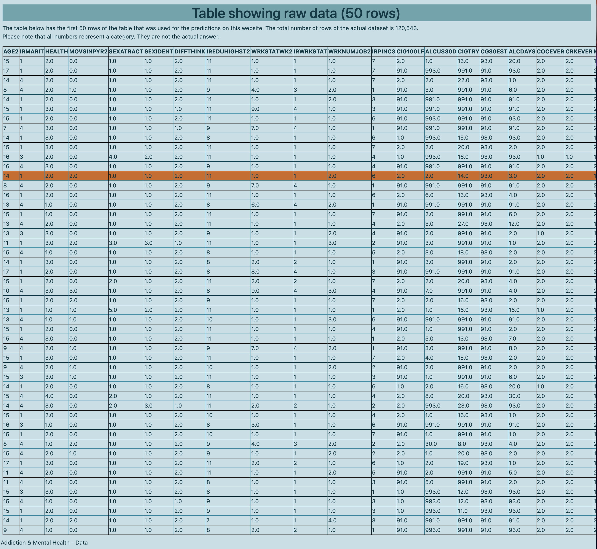
